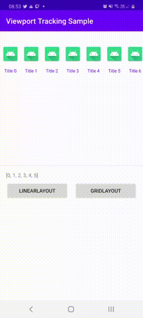
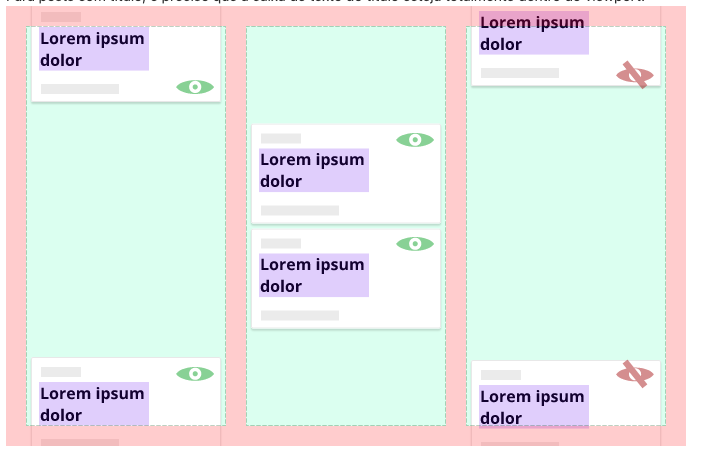
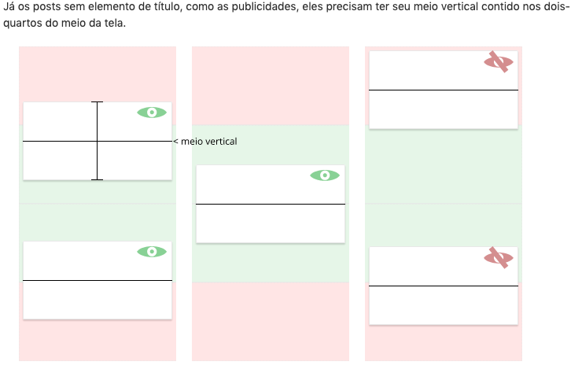

# View Port Android 

Viewport-Android is a library that aims to track items from a Recycler View, which remain visible in a given region on the screen (view port), for a minimum time of 250 milliseconds.

 - **[Sample](#sample)**
 
 - **[View Port Mobile](#view-port-mobile)**

 - **[View Port TV](#view-port-tv)**
 
 - **[Hitting Boxes](#hittingboxes)**
  
 - **[Change Log](#changelog)**
 
 - **[Getting Help](#help)**
 
 - **[License](#license)**

<a name="sample"></a>
# Sample
A [sample](sample) application is available that showcases the majority of the features offered by the View Port Android SDK.

There are cases where the user can "scroll" very quickly and pass several items through the viewport and therefore, we cannot count these items as seen.

For this reason, we had to create a temporal criterion to reduce false positives. Minimum stay of 250ms. This means that once the element replied that it is visible, there will be a new check specifically for this item after 250ms.

In the same way, we only stop counting time after a visibility pulse passes through the element, it responds negatively, the 250ms pass and there is a confirmation that it is no longer visible.





<a name="view-port-mobile"></a>
# View Port Mobile [](https://app.bitrise.io/app/c35ffcea29b2e8a6)
The library uses the concept of `custom views` in the implementation of its functionalities. Therefore, it is necessary that these views are incorporated into the XML files of your project layout.

#### Step 1: Install the SDK

Installing the View Port Mobile is simple if you're familiar with using external libraries or SDKs. To install the View Port TV SDK using `Gradle`, add the following lines to a `build.gradle` file at the app level.

```groovy
repositories {
   mavenCentral()
}

dependencies {
    implementation 'com.github.globocom:viewport-mobile:1.0.1'
}
````


#### Step 2: Configure ProGuard to shrink code and resources
When you build your APK with minifyEnabled true, add the following line to the module's ProGuard rules file.
```gradle
-keep class com.github.globocom.viewport.mobile.** { *; }
-keep class com.github.globocom.viewport.commons.** { *; }
```


#### Step 3: Start SDK
To initialize the sdk it is necessary to add the ViewPort Mobile in the xml:

```xml
<com.github.globocom.viewport.mobile.ViewPortRecyclerView
    android:id="@+id/view_port_recycler_view"
    android:layout_width="match_parent"
    android:layout_height="match_parent"/>
```

#### Step 4: Setup SDK
After installing and starting the sdk, we need to configure the following attributes in our class:

```kotlin
view_port_recycler_view.apply {
    viewedItemsLiveData.observe(this@MainActivity, Observer {
        viewed_items_tv.text = it.toString()
    })
    lifecycleOwner = this@MainActivity
}
```

*  `viewedItemsLiveData`: Returns a list of integers representing the positions of the `ViewPortRecyclerView` items that remained visible on the screen for more than 250ms.

*  `lifecycleOwner`:LifecycleOwner of the activity / fragment in use, so that the library can be reactive to events related to its life cycle.


<a name="view-port-tv"></a>
# View Port TV [](https://app.bitrise.io/app/c35ffcea29b2e8a6)
The library uses the concept of `custom views` in the implementation of its functionalities. Therefore, it is necessary that these views are incorporated into the XML files of your project layout.

The library acts as an extension to [Android Leanback][2]. For this reason, we provide two custom views that should be used according to the desired orientation:

 - **ViewPortHorizontalGridView**
 - **ViewPortVerticalGridView**


#### Step 1: Install the SDK

Installing the View Port TV SDK is simple if you're familiar with using external libraries or SDKs. To install the View Port TV SDK using `Gradle`, add the following lines to a `build.gradle` file at the app level.

```groovy
repositories {
   mavenCentral()
}

dependencies {
    implementation 'com.github.globocom:viewport-tv:1.0.1'
}
````


#### Step 2: Configure ProGuard to shrink code and resources
When you build your APK with minifyEnabled true, add the following line to the module's ProGuard rules file.
```gradle
-keep class com.github.globocom.viewport.tv.** { *; }
-keep class com.github.globocom.viewport.commons.** { *; }
```


#### Step 3: Start SDK
To initialize the sdk it is necessary to add the ViewPort TV in the xml:

```xml
<com.github.globocom.viewport.tv.ViewPortHorizontalGridView
    android:id="@+id/view_port_horizontal_grid_view"
    android:layout_width="match_parent"
    android:layout_height="match_parent"/>
```

Or 

```xml
<com.github.globocom.viewport.tv.ViewPortVerticalGridView
    android:id="@+id/view_port_vertical_grid_view"
    android:layout_width="match_parent"
    android:layout_height="match_parent"/>
```

#### Step 4: Setup SDK
After installing and starting the sdk, we need to configure the following attributes in our class:

```kotlin
view_port_vertical_grid_view.apply {
    viewedItemsLiveData.observe(this@MainActivity, Observer {
        viewed_items_tv.text = it.toString()
    })
    lifecycleOwner = this@MainActivity
}
```

*  `viewedItemsLiveData`: Returns a list of integers representing the positions of the `ViewPortHorizontalGridView` or  `ViewPortVerticalGridView` items that remained visible on the screen for more than 250ms.

*  `lifecycleOwner`:LifecycleOwner of the activity / fragment in use, so that the library can be reactive to events related to its life cycle.


<a name="hittingboxes"></a>
# Hitting Boxes

It is a little difficult to decide what is seen by the user without using an eyetracking tool. Even if something appears on the user's screen, it does not necessarily mean that he saw it and it tends to be even more inaccurate as the size of the viewport grows, as in a cinema display monitor for example.

To decrease the chances of a false positive, we have defined some rules of what we consider visible, to restrict the area of focus and evidence.

When it comes to hitting boxes, we can divide posts into two types: with and without a title. Each has its own definition of visibility detection.

For posts with a title, the title text box must be completely within the viewport.




As for posts without a title element, like advertisements, they need to have their vertical medium contained in the middle two-quarters of the screen.





<a name="changelog"></a>
# Changelog

see [Releases](CHANGELOG.md)


<a name="help"></a>
# Help
We use [GitHub Issues][1] as our bug and feature tracker both for code and for other aspects of the library (documentation, the wiki, etc.).  
Labels on issues are managed by contributors, you don't have to worry about them. Here's a list of what they mean:

 * **bug**: feature that should work, but doesn't
 * **enhancement**: minor tweak/addition to existing behavior
 * **feature**: new behavior, bigger than enhancement, it gives more bang
 * **question**: no need to modify sdk to fix the issue, usually a usage problem
 * **duplicate**: there's another issue which already covers/tracks this
 * **wontfix**: working as intended, or won't be fixed due to compatibility or other reasons
 * **non-library**: issue is not in the core library code, but rather in documentation, samples, build process, releases


License
-------

View Port is licensed under the [MIT License](https://github.com/globocom/view-port/blob/master/LICENSE.md).


## Sponsor

[](http://globo.com)


[1]: https://github.com/globocom/view-port/issues
[2]: https://developer.android.com/jetpack/androidx/releases/leanback
